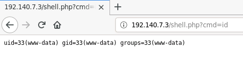
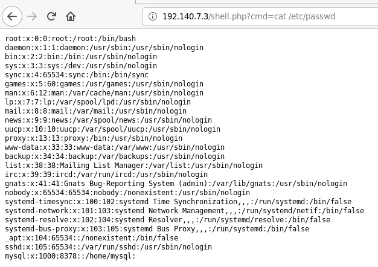

# AttackDefense: RCE via MySQL

---

Instructions: 
    This lab is dedicated to you! No other users are on this network :) 
    Once you start the lab, you will have access to a Kali GUI instance.
    Your Kali instance has an interface with IP address 192.X.Y.2. Run "ip addr" to know the values of X and Y.
    Do not attack the gateway located at IP address 192.X.Y.1

---

Сетевые адаптеры нашей Kali Linux:


Для начала проводим сканирование подсети 192.237.205.0/24 на наличие хостов:
```sh
nmap -n -PE 192.237.205.0/24
```


Помимо нашей машины (192.237.205.2) и шлюза (192.237.205.1), находим нужный нам хост и сканируем его:


```sh
nmap -sC -sV 192.237.205.3
```

На данном хосте активны следующие службы:
1. http
2. MySQL

Проверим, есть не пустой ли пароль при подключении к БД:

```sh
nmap --script mysql-empty-password -p 3306 192.237.205.3
```


Пытаемся подключиться напрямую к MySQL, используя **root** в качестве логина (пароля нет!)


Смотрим имеющиеся базы данных:


Смотрим БД веб-сервиса Adive, который также открыт на целевом хосте:


Видим хэши паролей, пробуем найти их значения:


Аккаунты:
- user:user
- admin:admin

Также, имея прямой доступ к MySQL, можно читать файлы внутри системы, например:


Заходим на веб сервис:


Также, можем организовать себе быстрый доступ к консоли внутри веб-ресурса:







