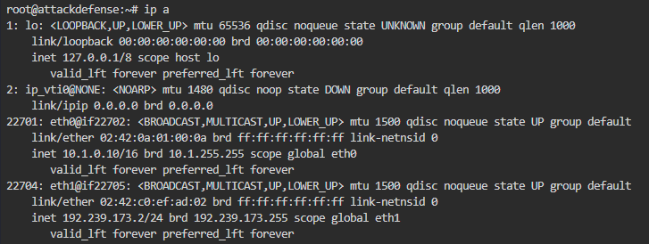
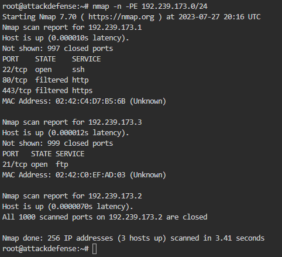
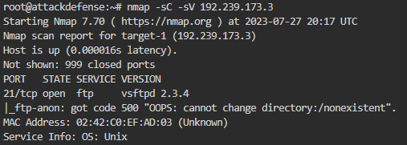
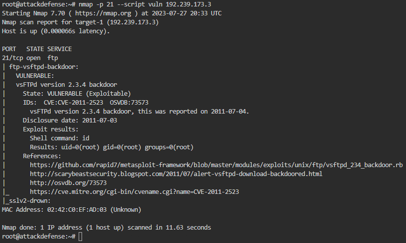
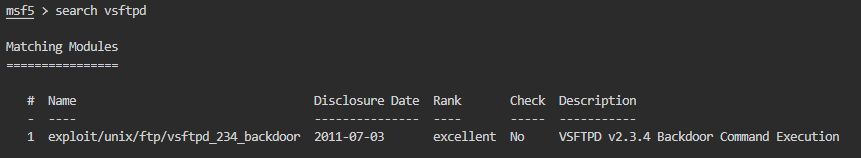
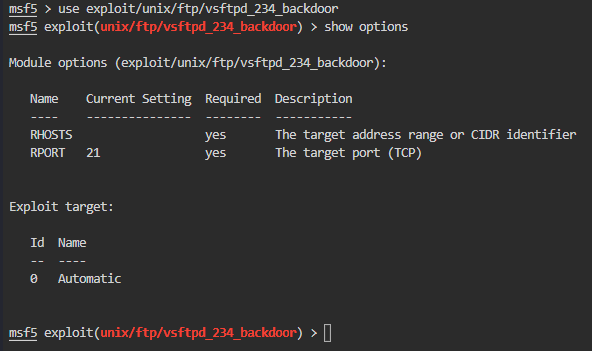
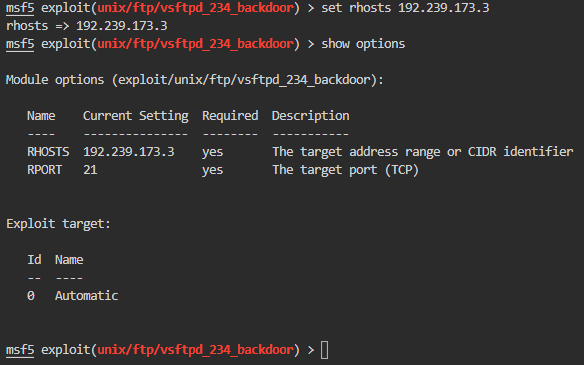
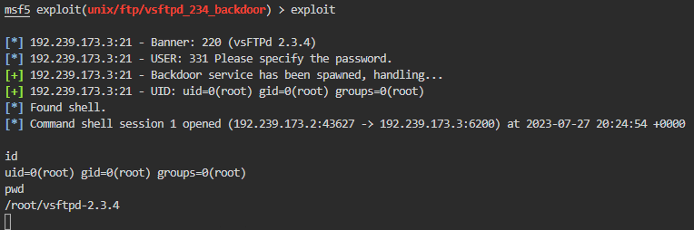

# AttackDefense: Vulnerable FTP Server

---

Instructions: 

1. This lab is dedicated to you! No other users are on this network :)
2. Once you start the lab, you will have access to a root terminal of a Kali instance
3. Your Kali has an interface with IP address 192.X.Y.Z. Run "ip addr" to know the values of X and Y.
4. The target server should be located at the IP address 192.X.Y.3.
5. Do not attack the gateway located at IP address 192.X.Y.1
6. postgresql is not running by default so Metasploit may give you an error about this when starting

---

Сетевые адаптеры нашей Kali Linux:



Для начала проводим сканирование подсети 192.239.173.0/24 на наличие хостов:

```sh
nmap -n -PE 192.239.173.0/24
```



Сканируем хост 192.239.173.3:

```sh
nmap -sC -sV 192.239.173.3
```



Более детально сканируем FTP-сервис:



Таким образом, узнаем, что служба уязвима, поэтому дальше переходим в **Metasploit** и ищем эксплойты на версию **vsftpd 2.3.4**:



Опции:



Устанавливаем параметр RHOSTS - указываем IP жертвы:



Активируем и получаем шелл от рута:


